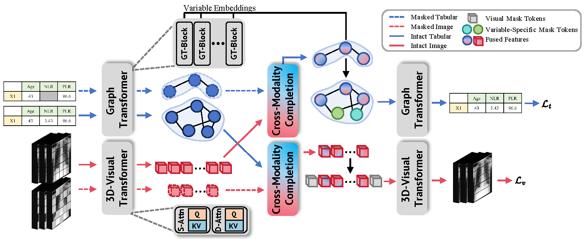

<h1 align="center">
Cross-Modality Masked Learning for Survival Prediction  
in ICI Treated NSCLC Patients
</h1>

<em>Qilong Xing, Zikai Song, Bingxin Gong, Lian Yang, Junqing Yu, Wei Yang</em>

    

During pretraining, both intact and masked versions of each modality are input
into their respective branches. In the multi-modal completion process, the masked
modality integrates features from the intact version of the other modality, which are
then passed into the decoder for reconstruction. In the visual decoder, a learnable mask
token is used, while in the graph transformer decoder, clinical variable-specific features
from the encoder serve as masked tokens.

## Code
🚧 The complete codebase is currently being reconstructed and will be uploaded progressively.

We appreciate your patience and interest!
